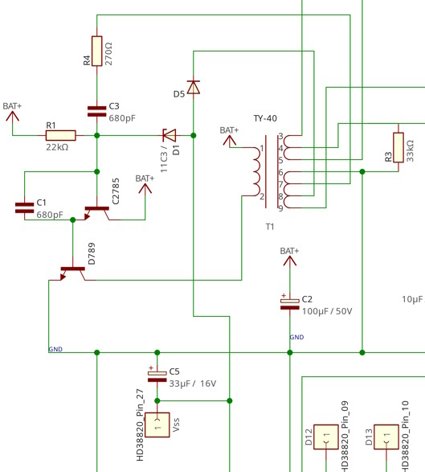

# FL Pengo (Bandai game) - Schematics and documentations

## What is FL Pengo?

[FL Pengo](https://segaretro.org/FL_Pengo) is game of Bandai Electronics release in 1983.

## License

[CC BY-SA](https://creativecommons.org/licenses/by-sa/4.0/)

This license enables reusers to distribute, remix, adapt, and build upon the material in any medium or format, so long as attribution is given to the creator. The license allows for commercial use. If you remix, adapt, or build upon the material, you must license the modified material under identical terms. CC BY-SA includes the following elements:

* BY: credit must be given to the creator.
* SA: Adaptations must be shared under the same terms.

## What is this repository?

In this repository, you can find the [LibrePCB](https://librepcb.org) workspace to view/modify FL Pengo game (the root of repository).

In `doc` folder, you have some documentations about this game.

In `images` folder, you have some picture that help you to understand schematic, view motherboard and screen with high definition.
You have also [full picture of schematic](./images/full-schematic.png).

## Motherboard

## Screen

## Control panel

